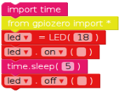

# Quick Reaction Game
within this tutorial you will create a quick reaction game using an electronic circuit, that we will create below and we will code it using a Raspberry Pi and EduBlocks.

## Equipment You Will Need

* 2 x Buttons
* 1 x LED
* 1 x Breadboard
* 1 x 220Ω resistor
* 6 x Male to Female jumper wires
* 1 x  Raspberry Pi set up

## Creating The circuit
Using the components within this kit create the circuit below.

**NOTE:** *Make sure you have the LED's the right way round. The longer leg is the postive leg, this is marked by a bent leg on the digram.*

## Opening EduBlocks

If EduBlocks is not already open double click on  This should be located on your Desktop.

## Controlling The LED
When programming a project it makes sense to break it down into sections so you can tackle one problem at a time. This also makes it easier to to test your project at different stages.

Lets start with coding the LED.

* To locate the pink blocks click on  

* To locate the yellow blocks click on  --> 

* To locate the red blocks click on  -->  --> 

To test that the code works click on .

If your LED does not turn on for 5 seconds and turn off again. you need to go back through your code and see where you went wrong. This is an important skill in programming called **debugging**. Which means finding and fixing errors or bugs within your code.

## Adding an Elemment of Surprise
The object of the game is to see who can press their button first when the LED goes off, so to make this better would be if the length of time the LED stayed on were random. You need to edit your code to make this happen.

To add the element of surprise we need to add the random library, which will be found in the  menu. Then we need to edit the time. sleep code.

Now run your code by clicking on  and your light should now come on for a random amount of time between 5 and 10 seconds.

## Coding the Buttons
Now that the LED is working, it is time to get the buttons working, so you can detect which player wins. Edit your code to look like the code below.

  

* To locate the blue code blocks click on  -->  --> 

## Writing the Function
At the end of the code we are now going to add a function, that will be called everytime a button is pressed.

## Adding the function to the buttons
We now need to add code to the buttons, so when they are pressed they call the function that we created

Now grab a friend and try out your game.

## Getting Player Names
Lets get players names, so the program will tell you who won, rather than which button was pressed.

To add the player names locate  and edit them to look like the code below.

## Editing the function

We now need to edit our function to output the name of the winner.

