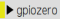
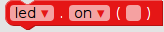

# Quick Reaction Game
within this tutorial you will create a quick reaction game using an electronic circuit, that we will create below and we will code it using a Raspberry Pi and EduBlocks.

## Equipment You Will Need

* 2 x Buttons
* 1 x LED
* 1 x Breadboard
* 1 x 220Ω resistor
* 6 x Male to Female jumper wires
* 1 x  Raspberry Pi set up

## Creating The circuit
The circuit you are going to build consists of 2 push buttons and 1 LED.

1. Take one of the push buttons and push it into the holes at the end of your breadboard.

2. Take the other button and push it into the holes at the opposite end of your breadboard to where the first button is.

3. Take the LED and push it into the holes on your breadboard in between the 2 buttons. (remember where the longer leg is.)

4. Take the resistor and push it into the holes on your breadboard in the same column as the shorter leg of the LED.

Now we need to add the jumper wires to connect the components to the Raspberry Pi.

5. Take 1 of the Male to Female jumper wires and connect the end with the point to the first leg of the button on the left and connect the other end of the wire to GND (ground) on the Raspberry Pi. (GND is the third pin down)

6. Now another Male to Female jumper wire and connect it to the other leg of the button. This time the other end of the wire connects to GPIO14 on the raspberry pi. This is located next to the GND pin. (4th pin down)

7. Take another Male to Female jumper wire and connect it to the Leg of the LED with the resistor attached to it and connect the other end to GND on the Raspberry Pi. (7 pins down)

8. Take another jumper wire and connect it to the other leg of the LED and GPIO18 on the Raspberry Pi. (6 pins down)

9. Take another jumper wire and connect it to the leg of the button closest to the LED and connect the other end to GND on the Raspberry Pi. (10 pins down)

10. take the last of the jumper wires and connect it to the other leg of the button and the other end to GPIO25 on the Raspberry Pi. ( 11 pins down)

## Controlling The LED
When programming a project it makes sense to break it down into sections so you can tackle one problem at a time. This also makes it easier to to test your project at different stages.

1. Click on the  Icon on the Desktop.

2. The first thing we need to do is import the time library to do this click on the  and locate  block and drag it to the right into the coding area.

3. Next we need to import the gpiozero library. To do this click on  menu then click on the  and locate the  block and drag it to the coding area attaching it under the  block.

4. Now we need to set up the LED. To do this click on  menu. Then click on  menu and locate the  block and drag it to the coding area attaching it under the  block. click inbetween the brackets *(pin)* on the  block and delete *pin* and type *18*. This tells the Raspberry Pi that the LED is connected to GPIO18.

5. Now we are going to turn the LED on. To do this locate the  block and drag it to the coding area and attach it under the  block.

6. Now we want our program to wait 5 seconds. To do this click on the  and locate the  block and drag it to the coding area attaching it under the  block. Click inbetween the brackets *()* of the  block where it says *1* and delete the 1 and type *5*.

7. Now we need to turn the LED off. To do this click on  menu, then click on the  menu, then on  and locate another  block and drag it to the coding area attaching it under the  block. Now click on the little arrow next to *on* and you should see a menu like this  and click on off.

Your code should look like this:

.

To test that the code works click on .

If your LED does not turn on for 5 seconds and turn off again. you need to go back through your code and see where you went wrong. This is an important skill in programming called **debugging**. Which means finding and fixing errors or bugs within your code.

## Adding an Elemment of Surprise
The object of the game is to see who can press their button first when the LED goes off, so to make this better would be if the length of time the LED stayed on were random. You need to edit your code to make this happen.

1. We need to add the random library. To do this click on  and locate the  block and drag it to the coding area and attach it to the top of the  block. (this will become the start of your code block)

2. Next locate this  and edit the block to read 

Your code should now look like this:

Now run your code by clicking on  and your light should now come on for a random amount of time between 5 and 10 seconds.

## Coding the Buttons
